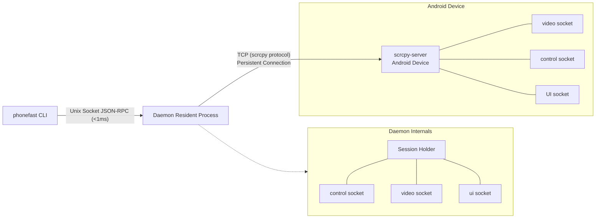
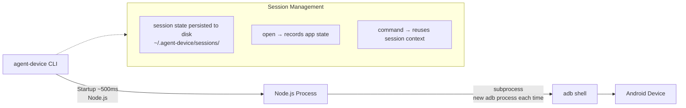
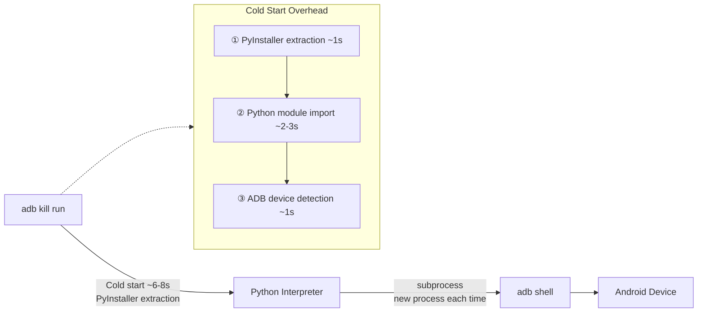
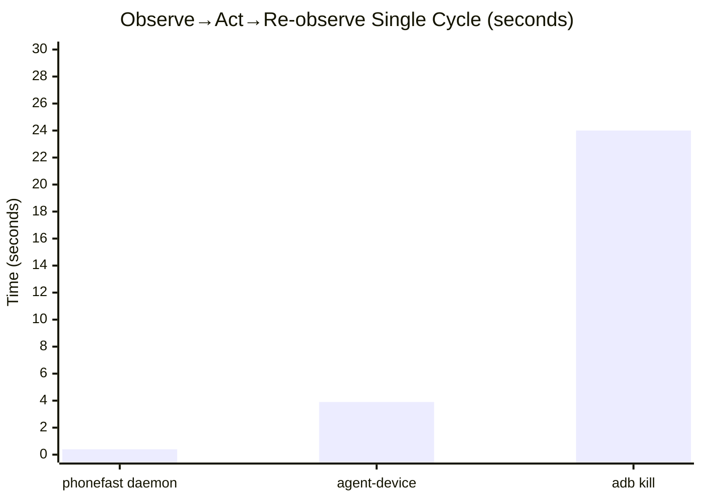
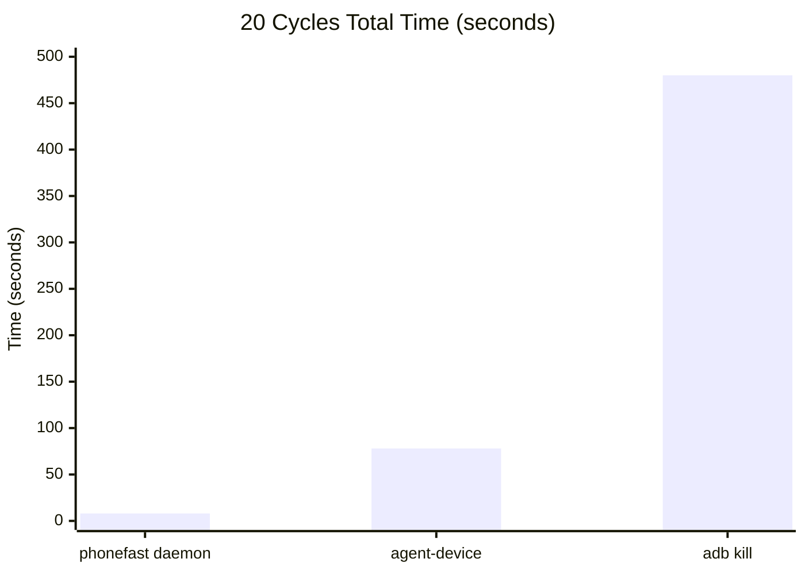
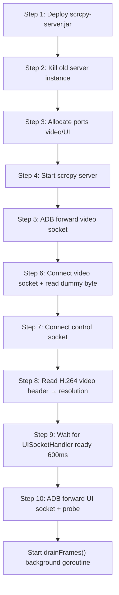
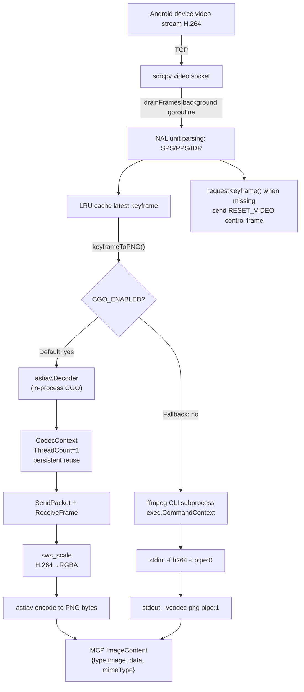
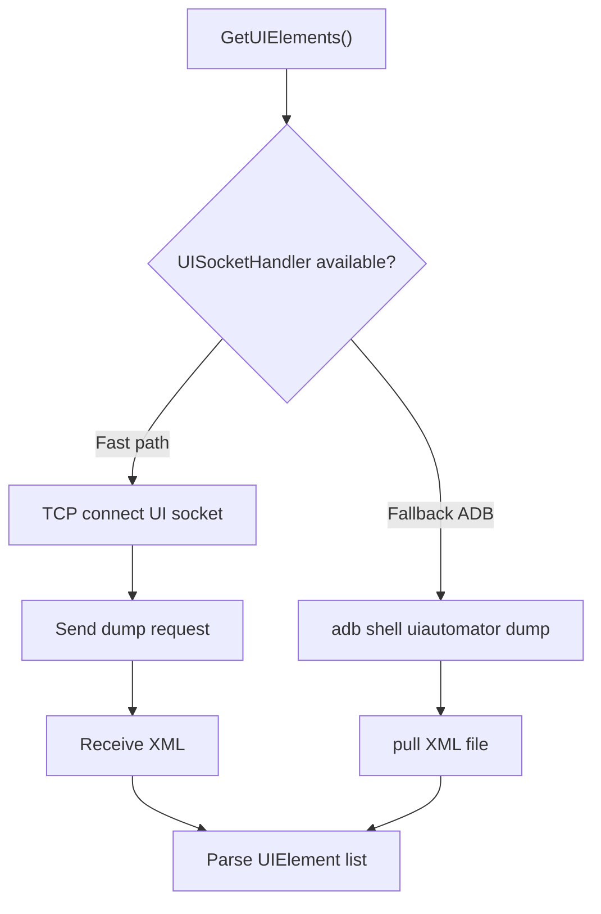
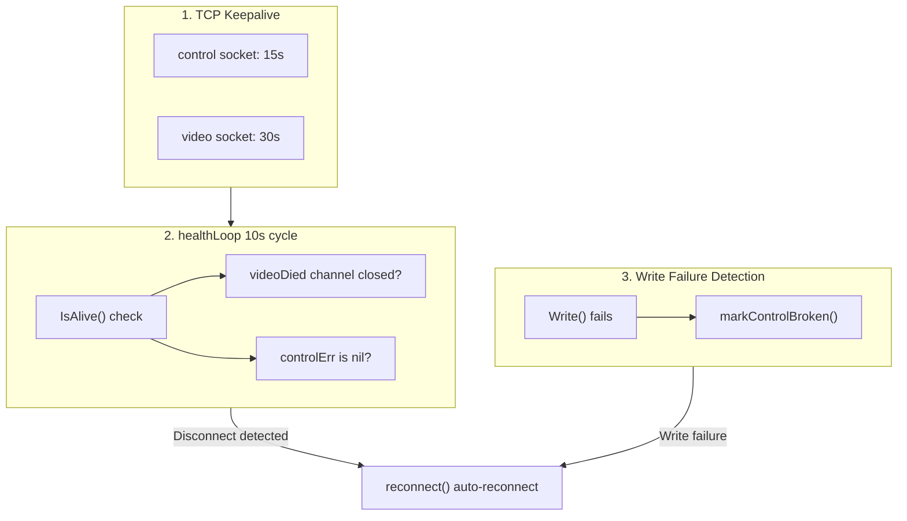
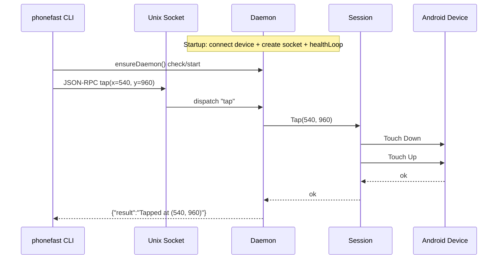

**Have you ever encountered these issues?**

1. adb keeps failing to select the right element or selects the wrong one, causing Vibe Coding to burn through tokens🔥🔥🔥🔥🔥.
2. adb dump xml fails, forcing you to rely solely on screenshots for verification — but the model is single-modal😖😖😖😖

**phonefast**: Precisely cracks the four deadly pain points of Harness Coding in mobile verification — Slow, Inaccurate, Token-burning🔥, Unstable — broken one by one.

| Pain Point | Solution | Effect |
|------|------|------|
| 🐢 **Slow** | Daemon resident process + Unix Socket JSON‑RPC | <10ms touch latency, 100x faster than ADB shell |
| 🎯 **Inaccurate** | Atomic observe, screenshot + UI tree returned in one call | Completely eliminates the race window of "UI changed after screenshot" |
| 🔥 **Token burning** | MCP native ImageContent, multimodal direct output | No more stuffing dozens of KB of base64 into JSON, tokens halved |
| 🛡️ **Unstable** | Three-level keepalive + auto-reconnect + panic self-heal | 12-hour stress test, 140k+ operations, 99.99% success rate |

{:.prompt-info}

## 📺 Video Comparison


Click to watch the full comparison video: [【PhoneFast vs PhoneMCP】AI Execution Comparison](https://www.bilibili.com/video/BV1RZTT6wEEf/)

## Installation

```bash
npx skills add gezihua123/phonefast-skill --skill phonefast-skill
```

[📥 Download](https://github.com/gezihua123/phonefast/releases/tag/v1.0.11) | [GitHub Repository](https://github.com/gezihua123/phonefast)

---

## 1. Architecture Comparison

### phonefast (Go + scrcpy)



- **Language**: Go compiled native binary, startup <10ms
- **Connection**: scrcpy protocol, TCP tunnel directly to scrcpy-server on device
- **Daemon**: Background resident process, holds persistent device connection, receives commands via Unix Socket
- **Cold start**: <10ms (Go native binary)
- **Command latency**: daemon mode <1ms socket communication + ~12ms screenshot decoding (astiav CGO in-process) + Android processing

### agent-device (TypeScript + ADB)



- **Language**: TypeScript (Node.js CLI), startup ~500ms
- **Connection**: Raw ADB commands (`adb shell input/keyevent/screencap/uiautomator`)
- **Session**: App state persisted to disk after opening, session context reused between commands
- **Cold start**: ~500ms (Node.js process startup)
- **Command latency**: ~450-750ms (Node.js process + adb shell)

### adb kill (Python + ADB)



- **Language**: Python (packaged as single file via PyInstaller, extracted at runtime)
- **Connection**: Raw ADB commands (`adb shell input/keyevent/screencap/uiautomator`)
- **State**: Stateless, each command goes through full "start → execute → exit" flow
- **Cold start**: ~6-8s (PyInstaller extraction + Python module import + ADB detection)
- **Command latency**: ~7-9s (extraction ~1s + import ~2-3s + ADB ~1s + subprocess ~2s + parsing ~0.5s)

---

## 2. Speed Comparison

> **Test Environment**: macOS arm64 | Go 1.26 | Node.js v22.20 | agent-device v0.17.6 | **phonefast v1.0.11**
>
> **Device**: TECNO KL8h (USB) | Resolution 488×1080 | Test Date: 2026-07-14
>
> **Method**: Average of 3 runs per operation, `perl -MTime::HiRes` full-chain timing; phonefast data from 12-hour stress test (145,843 operations)

| Operation | phonefast daemon | agent-device | adb kill | vs agent | vs adb |
|------|:---:|:---:|:---:|:---:|:---:|
| back | **12ms** | 520ms | 8,505ms | **43x** | **709x** |
| home | **13ms** | 550ms | 8,864ms | **42x** | **682x** |
| tap coordinate click | **13ms** | 748ms | 8,110ms | **58x** | **624x** |
| swipe (300ms) | **318ms** | N/A¹ | 8,200ms | — | **26x** |
| type_text | **1ms** | 32,700ms² | 7,890ms | **32,700x** | **7,890x** |
| screenshot | **28ms** | 2,593ms | 8,939ms | **93x** | **319x** |
| UI elements | **46ms** | FAILED² | 7,600ms | — | **165x** |
| observe (screenshot+UI) | **28ms** | N/A | ~15,500ms³ | — | **554x** |
| launch app | **1ms** | 782ms⁴ | 8,240ms | **782x** | **8,240x** |

{:.annotation}

### Typical AI Agent Interaction Loop





---

## 3. Architectural Dimension Comparison

| Dimension | phonefast | agent-device | adb kill |
|------|-----------|--------------|-----------|
| **Language** | Go (native binary) | TypeScript (Node.js) | Python (PyInstaller) |
| **Binary Size** | 11MB | ~3MB (npm) | 41MB |
| **Running Memory** | <62MB RSS | ~30-50MB RSS | ~20-40MB (new process each time) |
| **Cold Start** | <10ms | ~500ms | ~7s |
| **Connection Method** | scrcpy protocol (TCP tunnel) | ADB commands | ADB commands |
| **Daemon Mode** | ✅ Resident process + Unix Socket | ✅ session-state on disk | ❌ Cold start each time |
| **Command Latency** | 1-13ms | 450-750ms | 7-9s |
| **Screenshot Method** | scrcpy H.264 keyframe → astiav CGO decode PNG | adb screencap → pull PNG | adb screencap → pull PNG |
| **UI Parsing** | UISocketHandler (TCP socket) | uiautomator dump | uiautomator dump |
| **UI Stability** | ⭐⭐⭐⭐⭐ | ⭐⭐ (uiautomator often times out) | ⭐⭐⭐ |
| **Persistent Connection** | scrcpy server resident on device | No persistent connection | No persistent connection |
| **Session Management** | Daemon in-memory | State persisted to disk | Stateless |
| **Disconnect Recovery** | Three-level keepalive, auto-reconnect in 10s | Session state file recovery | Stateless |
| **MCP Protocol** | ✅ SSE / STDIO (8019) | ✅ `agent-device mcp` | ✅ SSE / STDIO (8009) |
| **Cross-Platform** | Android only | iOS / Android / TV / Desktop | Android only |
| **ImageContent** | ✅ (MCP native) | ❌ | ❌ |

---

## 4. Feature Comparison

| Feature | phonefast | agent-device | adb kill |
|------|:---:|:---:|:---:|
| tap coordinate click | ✅ | ✅ | ✅ |
| swipe custom coordinates | ✅ | ❌ (preset directions only) | ✅ |
| type_text | ✅ | ✅ | ✅ |
| screenshot | ✅ (H.264→PNG) | ✅ (screencap) | ✅ (screencap) |
| UI elements (xml) | ✅ UISocketHandler | ❌ | ✅ |
| observe (screenshot+UI) | ✅ (atomic operation) | ❌ | ❌ |
| tap_element | ✅ (MCP mode) | ✅ | ✅ |
| launch_app | ✅ | ✅ | ✅ |
| batch execution | ✅ `run` JSON | ✅ `batch` | ✅ `run` JSON |
| MCP server | ✅ `serve` (8019) | ✅ `mcp` | ✅ `serve` (8009) |
| ImageContent | ✅ (MCP native) | ❌ | ❌ |
| non-ASCII input | ❌ | ❌ | ✅ DEX helper |
| multi-platform | ❌ | ✅ iOS/Android/TV | ❌ |

---

## 5. Implementation Principles

### 5.1 Session Lifecycle



### 5.2 Screenshot Pipeline (v1.0.11 Architecture)

> v1.0.11 refactored the screenshot pipeline from **ffmpeg subprocess** to **astiav CGO in-process decoding**, eliminating subprocess creation + pipe I/O overhead, reducing screenshot latency by 3-4x.
>
> The ffmpeg subprocess fallback path is retained (`CGO_ENABLED=0` auto-switch).



**Two Path Comparison**:

| Dimension | Main Path (astiav CGO) | Fallback Path (ffmpeg CLI) |
|------|-------------------|---------------------|
| Trigger | `CGO_ENABLED=1` (default build) | `CGO_ENABLED=0` (cross-compile, etc.) |
| Decode Method | In-process C function call | `fork + exec` subprocess |
| Data Transfer | Zero-copy memory pointer passing | pipe stdin → stdout (memcpy ×2) |
| Codec Context | **Persistent reuse** (DPB retained) | New process each time (SPS/PPS re-parsed) |
| Threads | **ThreadCount=1** | Default multi-thread |
| Screenshot P50 | **28ms** 🚀 | ~100-200ms |
| Cold Start Screenshot | **~19ms** | ~167ms |
| External Dependencies | None (FFmpeg statically linked) | System requires ffmpeg installed |

**Why single thread is faster**:
- 488×1080 single-frame decoding is tiny; multi-thread slicing sync overhead > decode itself
- Multi-thread causes DPB (Decoded Picture Buffer) double allocation, memory bloat
- ThreadCount=1 eliminates slice-merge and inter-thread sync, more stable latency

**Why persistent context is faster than new**:
- Each `SendPacket(nil)` flush reinitialization → +55ms (SPS/PPS re-parse + DPB rebuild)
- Persistent context reuses previous frame's reference buffer, new IDR naturally overwrites old
- No flush = zero extra overhead

**Why keyframes**:
- I-frames (IDR/Keyframe) contain the complete picture, can be decoded independently
- P/B-frames only contain delta data, depend on reference frames
- Screenshots must use I-frames; when missing, `RESET_VIDEO` triggers device to generate one immediately

### 5.3 UI Element Retrieval



phonefast's `UISocketHandler` is a custom extension of scrcpy-server, providing UI dump service via abstract socket, approximately 40% faster than `uiautomator dump`.

### 5.4 Keepalive & Disconnect Recovery



### 5.5 Daemon Mode



### 5.6 MCP ImageContent Return

```json
{
  "content": [
    {"type": "text",      "text": "Screenshot (1080x2400)"},
    {"type": "image",     "data": "iVBORw0KGgoAAA...", "mimeType": "image/png"}
  ]
}
```

---

## 6. Long-duration Stress Test (v1.0.11 Optimized)

> 12-hour continuous stress test, 145,843 operations, **100% success rate**, zero disconnections.

| Metric | Value |
|------|------|
| **Duration** | 720 minutes (12 hours) |
| **Total Operations** | 145,843 |
| **Successful** | 145,843 |
| **Failed** | 0 |
| **Success Rate** | **100%** |
| **Daemon Disconnects** | 0 |
| **Performance Degradation** | ❌ None |
| **RSS Peak** | <62MB |

**12 Operation Latency Overview**:

| Operation | Count | P50 | P95 | P99 | Avg | Max |
|------|:---:|:---:|:---:|:---:|:---:|:---:|
| `tap` | 49,943 | **13ms** | 13ms | 14ms | 12ms | 453ms |
| `back` | 16,639 | **13ms** | 13ms | 14ms | 12ms | 474ms |
| `home` | 16,642 | **13ms** | 13ms | 14ms | 12ms | 18ms |
| `press_key` | 16,650 | **13ms** | 13ms | 14ms | 12ms | 18ms |
| `swipe` | 8,384 | **318ms** | 322ms | 323ms | 318ms | 821ms |
| `screenshot` | 4,185 | **28ms** | 126ms | 128ms | 49ms | 132ms |
| `observe` | 4,188 | **28ms** | 126ms | 129ms | 51ms | 134ms |
| `get_ui_elements` | 4,189 | **46ms** | 132ms | 151ms | 61ms | 192ms |
| `type_text` | 4,188 | **1ms** | 1ms | 2ms | 1ms | 6ms |
| `launch_app` | 4,187 | **1ms** | 1ms | 2ms | 1ms | 5ms |
| `status` | 4,189 | **1ms** | 1ms | 2ms | 1ms | 3ms |
| `wait` | 12,459 | **33ms** | 33ms | 33ms | 32ms | 38ms |

---

## 7. Use Cases

### phonefast daemon → AI Agent First Choice

- High-frequency AI Agent interaction (observe→act→re-observe loop)
- Requires ultra-low latency (<30ms)
- Batch automation scripts
- Requires MCP ImageContent native image return

```bash
phonefast daemon                              # Start (one-time only)
phonefast --daemon tap 540 960                # Tap (13ms)
phonefast --daemon screenshot /tmp/s.png      # Screenshot (28ms)
phonefast --daemon observe                    # Screenshot+UI (28ms)
```

### Recommended Stack

```
Primary:   phonefast daemon  (Speed King, Android AI Agent First Choice)
           + phonefast serve  (MCP mode, includes tap_element)

Supplemental: agent-device  (when iOS automation / recording replay / performance sampling needed)
              adb kill      (when OCR / non-ASCII input / package search needed)
```

---

### Why phonefast is More Stable

```
phonefast:  scrcpy-server resident on device, TCP connection sustained for 12+ hours
            daemon in-memory session, zero state reconstruction overhead between commands
            three-level keepalive (TCP keepalive + healthLoop + write failure detection)

agent-device/adb kill: new adb shell subprocess for each command, destroyed after use
                       no persistent connection, read session or cold start each time
                       command failure = error, no auto-recovery
```
