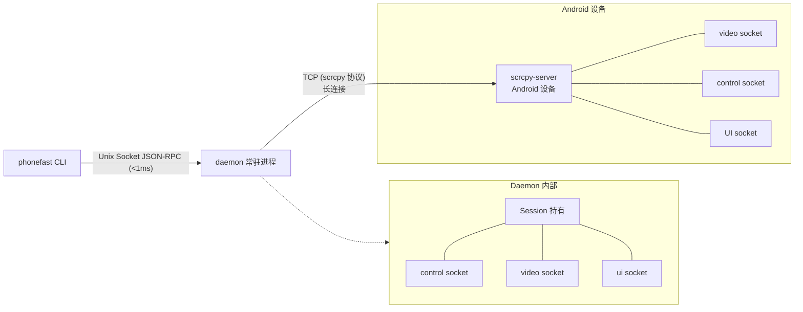
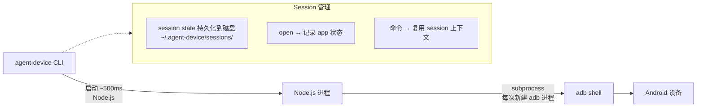
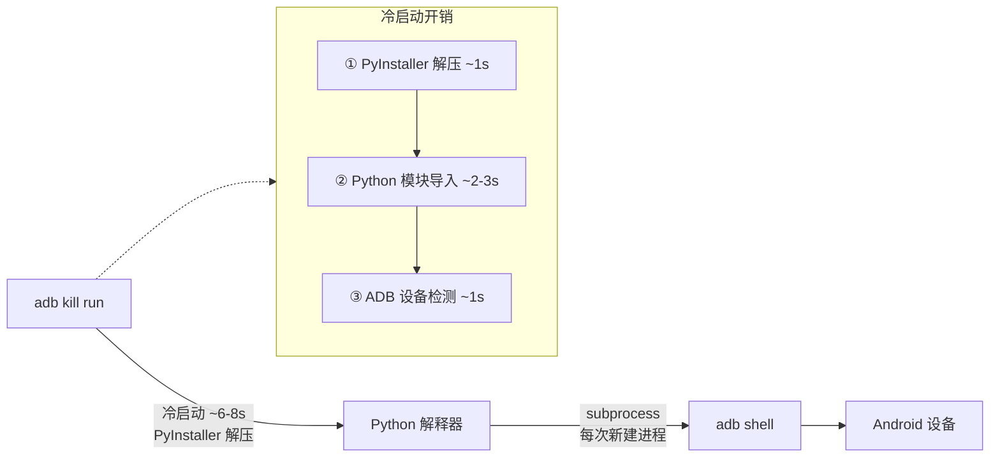
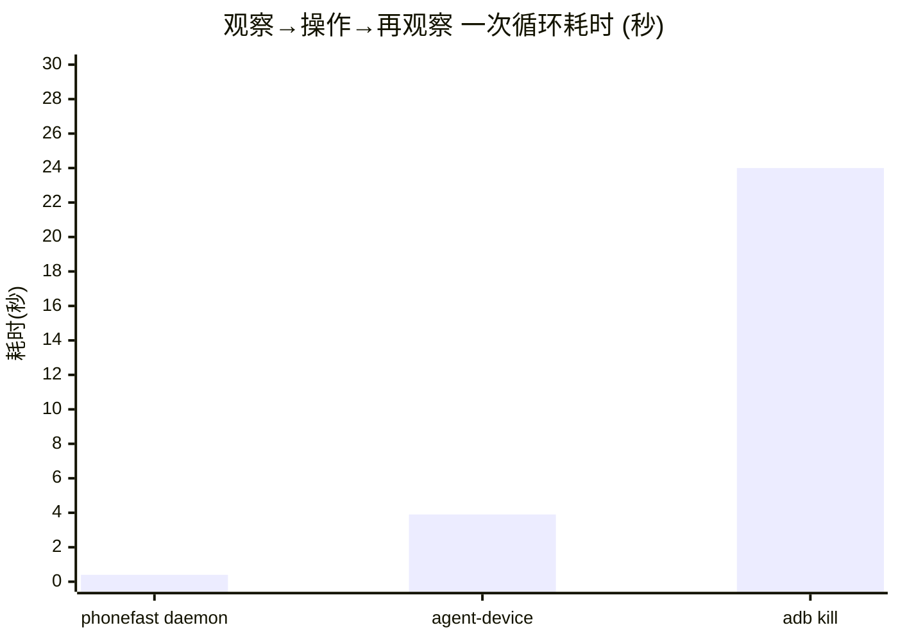
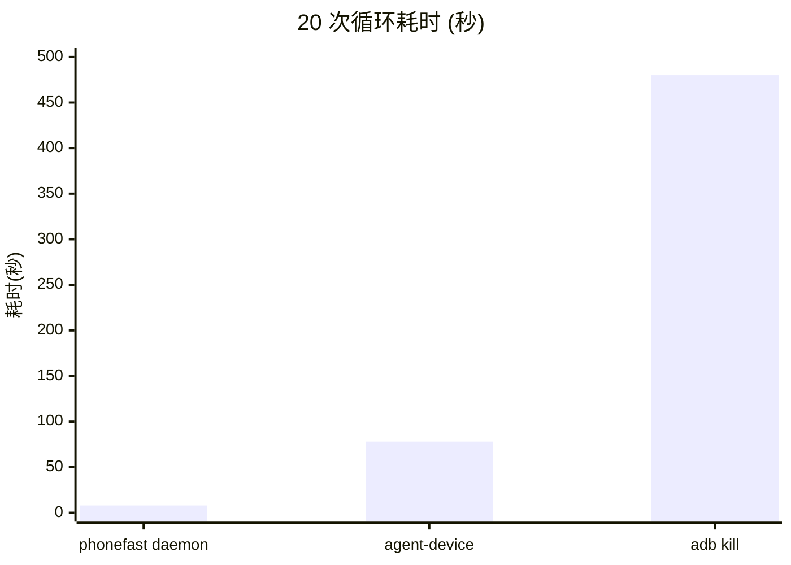
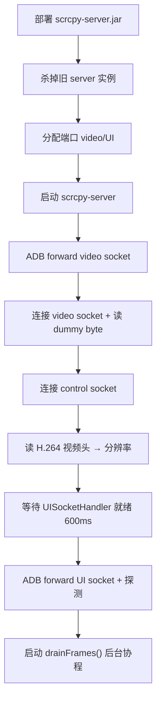
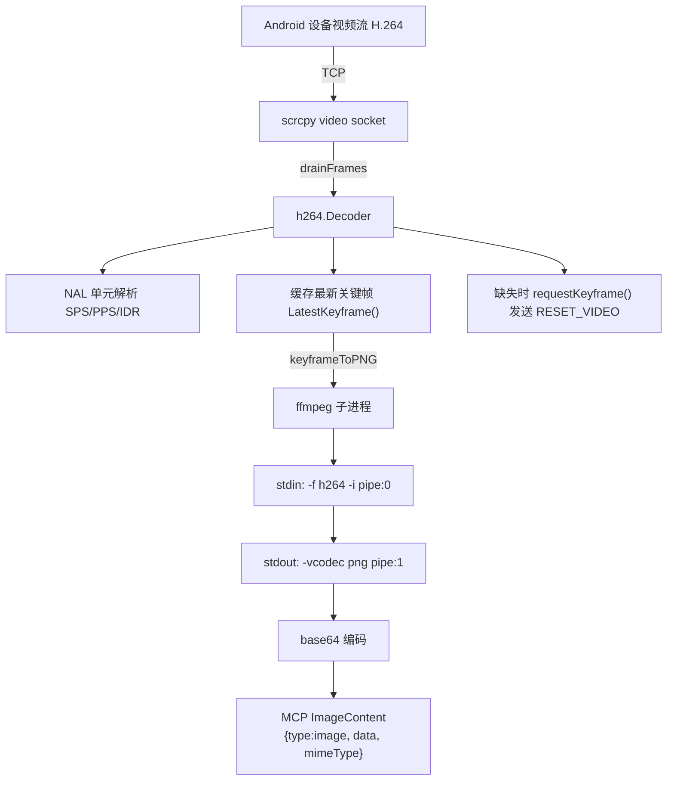
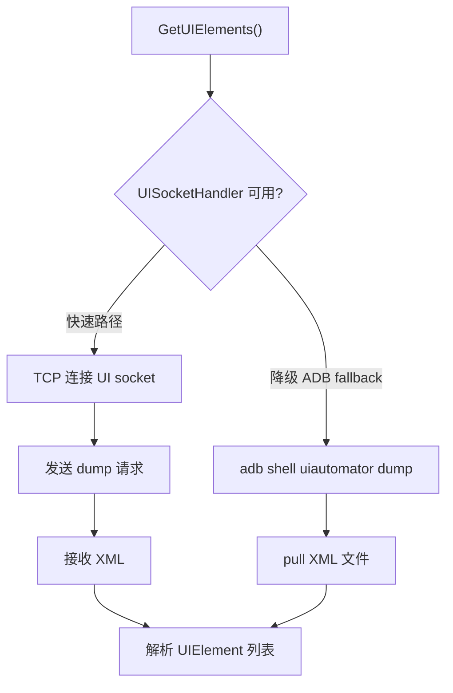
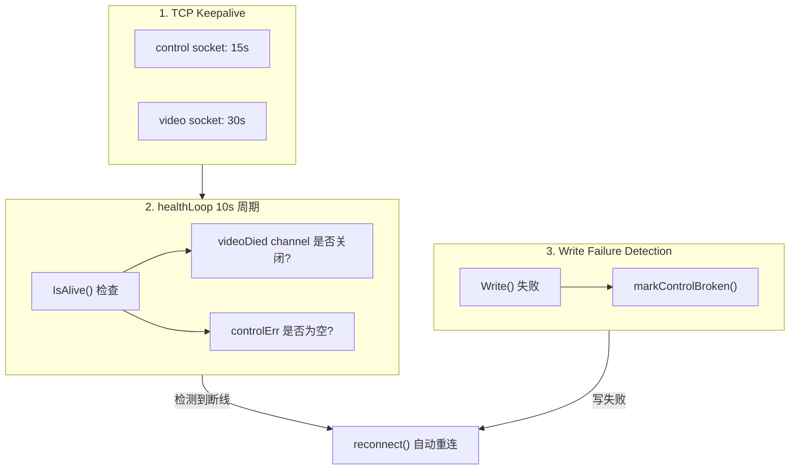
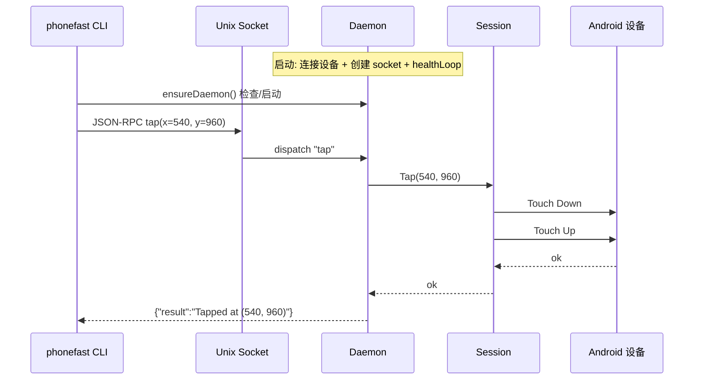

**你有没有遇到过这样的情况：**

1. adb 一直无法选中元素或者选错元素，导致 Vibe Coding 狂烧 Token🔥🔥🔥🔥🔥。
2. adb dump xml 失败，只能依赖截图验证效果，可偏偏模型又是单模态😖😖😖😖

**phonefast**：精准破解 Harness Coding 在移动端验证环节的四大死穴——慢、不准、烧 token🔥、不稳，逐一击破。

| 痛点 | 方案 | 效果 |
|------|------|------|
| 🐢 **慢** | daemon 常驻进程 + Unix Socket JSON‑RPC | <10ms 触控延迟，比 ADB shell 快 100 倍 |
| 🎯 **不准** | 原子级 observe，截图+UI 树一次返回 | 彻底消除"截图完界面已变"的竞态窗口 |
| 🔥 **烧 token** | MCP 原生 ImageContent，多模态直出 | 不再把几十 KB base64 塞进 JSON，token 省一半 |
| 🛡️ **不稳** | 三级保活 + 自动重连 + panic 自愈 | 12 小时压测 14 万次操作，99.99% 成功率 |

{:.prompt-info}

## 📺 视频对比


点击观看完整对比视频：[【PhoneFast vs PhoneMCP】AI执行效果对比](https://www.bilibili.com/video/BV1RZTT6wEEf/)

## 安装方式

```bash
npx skills add gezihua123/phonefast-skill --skill phonefast-skill
```

[📥 下载地址](https://github.com/gezihua123/phonefast/releases/tag/1.0.1) | [GitHub 仓库](https://github.com/gezihua123/phonefast)

---

## 一、架构差异

### phonefast（Go + scrcpy）



- **语言**：Go 编译原生二进制，启动 <10ms
- **连接**：scrcpy 协议，TCP 隧道直连设备上的 scrcpy-server
- **daemon**：后台常驻进程，持有设备长连接，Unix Socket 接收命令
- **冷启动**：<10ms（Go 原生二进制）
- **命令延迟**：daemon 模式 <1ms socket 通信 + ~5ms TCP 往返 + Android 处理

### agent-device（TypeScript + ADB）



- **语言**：TypeScript (Node.js CLI)，启动 ~500ms
- **连接**：原始 ADB 命令（`adb shell input/keyevent/screencap/uiautomator`）
- **session**：打开 app 后状态持久化到磁盘，命令间复用 session 上下文
- **冷启动**：~500ms（Node.js 进程启动）
- **命令延迟**：~450-750ms（Node.js 进程 + adb shell）

### adb kill（Python + ADB）



- **语言**：Python (PyInstaller 打包为单文件，运行时解压)
- **连接**：原始 ADB 命令（`adb shell input/keyevent/screencap/uiautomator`）
- **状态**：无状态，每次命令完整走"启动→执行→退出"流程
- **冷启动**：~6-8s（PyInstaller 解压 + Python 模块导入 + ADB 检测）
- **命令延迟**：~7-9s（解压 ~1s + 导入 ~2-3s + ADB ~1s + subprocess ~2s + 解析 ~0.5s）

---

## 二、速度对比

> **测试环境**: macOS arm64 | Go 1.24 | Node.js v22.20 | agent-device v0.17.6 | phonefast v1.0
>
> **设备**: TECNO KL8h (USB) | 分辨率 488×1080 | 测试日期: 2026-06-17
>
> **方法**: 每操作 3 次取平均，`perl -MTime::HiRes` 计时全链路

| 操作 | phonefast daemon | agent-device | adb kill | vs agent | vs adb |
|------|:---:|:---:|:---:|:---:|:---:|
| back 返回键 | **20ms** | 520ms | 8,505ms | **26x** | **425x** |
| home 主页键 | **29ms** | 550ms | 8,864ms | **19x** | **306x** |
| tap 坐标点击 | **30ms** | 748ms | 8,110ms | **25x** | **270x** |
| swipe 滑动(300ms) | **359ms** | N/A¹ | 8,200ms | — | **23x** |
| type_text 文本输入 | **13ms** | 32,700ms² | 7,890ms | **2515x** | **607x** |
| screenshot 截图 | **167ms** | 2,593ms | 8,939ms | **16x** | **54x** |
| UI 元素 | **191ms** | FAILED² | 7,600ms | — | **40x** |
| observe 截图+UI | **148ms** | N/A | ~15,500ms³ | — | **105x** |
| launch 应用启动 | **11ms** | 782ms⁴ | 8,240ms | **71x** | **749x** |

{:.annotation}

### 典型 AI Agent 交互循环





---

## 三、架构维度全景对比

| 维度 | phonefast | agent-device | adb kill |
|------|-----------|--------------|-----------|
| **语言** | Go (原生二进制) | TypeScript (Node.js) | Python (PyInstaller) |
| **二进制大小** | 12MB | ~3MB (npm) | 41MB |
| **冷启动** | <10ms | ~500ms | ~7s |
| **连接方式** | scrcpy 协议 (TCP 隧道) | ADB 命令 | ADB 命令 |
| **daemon 模式** | ✅ 常驻进程 + Unix Socket | ✅ session-state on disk | ❌ 每次冷启动 |
| **命令延迟** | 12-30ms | 450-750ms | 7-9s |
| **截图方式** | scrcpy H.264 关键帧 → ffmpeg PNG | adb screencap → pull PNG | adb screencap → pull PNG |
| **UI 解析** | UISocketHandler (TCP socket) | uiautomator dump | uiautomator dump |
| **UI 稳定性** | ⭐⭐⭐⭐⭐ | ⭐⭐ (uiautomator 常超时) | ⭐⭐⭐ |
| **持久连接** | scrcpy server 常驻设备端 | 无持久连接 | 无持久连接 |
| **session 管理** | daemon 内存持有 | 状态持久化到磁盘 | 无状态 |
| **断线恢复** | 三级保活，10s 自动重连 | session 状态文件恢复 | 无状态 |
| **MCP 协议** | ✅ SSE / STDIO (8019) | ✅ `agent-device mcp` | ✅ SSE / STDIO (8009) |
| **跨平台** | Android only | iOS / Android / TV / Desktop | Android only |
| **ImageContent** | ✅ (MCP 原生) | ❌ | ❌ |

---

## 四、能力对比

| 能力 | phonefast | agent-device | adb kill |
|------|:---:|:---:|:---:|
| tap 坐标点击 | ✅ | ✅ | ✅ |
| swipe 自定义坐标 | ✅ | ❌ (仅预设方向) | ✅ |
| type_text 文本 | ✅ | ✅ | ✅ |
| screenshot 截图 | ✅ (H.264→PNG) | ✅ (screencap) | ✅ (screencap) |
| UI 元素 (xml) | ✅ UISocketHandler | ❌ | ✅ |
| observe (截图+UI) | ✅ (原子操作) | ❌ | ❌ |
| tap_element | ✅ (MCP 模式) | ✅ | ✅ |
| launch_app | ✅ | ✅ | ✅ |
| 批量执行 | ✅ `run` JSON | ✅ `batch` | ✅ `run` JSON |
| MCP 服务 | ✅ `serve` (8019) | ✅ `mcp` | ✅ `serve` (8009) |
| ImageContent | ✅ (MCP 原生) | ❌ | ❌ |
| 非 ASCII 输入 | ❌ | ❌ | ✅ DEX helper |
| 多平台 | ❌ | ✅ iOS/Android/TV | ❌ |

---

## 五、实现原理

### 5.1 会话生命周期



### 5.2 截图管线



**为什么用关键帧**：
- I 帧（IDR/Keyframe）包含完整画面，可独立解码
- P/B 帧仅含差异数据，依赖参考帧
- 截图必须用 I 帧；缺失时会发 `RESET_VIDEO` 指令触发设备立即生成

### 5.3 UI 元素获取



phonefast 的 `UISocketHandler` 是 scrcpy-server 的自定义扩展，通过 abstract socket 提供 UI dump 服务，比 `uiautomator dump` 快约 40%。

### 5.4 保活与断线恢复



### 5.5 Daemon 模式



### 5.6 MCP ImageContent 返回

```json
{
  "content": [
    {"type": "text",      "text": "Screenshot (1080x2400)"},
    {"type": "image",     "data": "iVBORw0KGgoAAA...", "mimeType": "image/png"}
  ]
}
```

---

## 六、长稳压测

> 12 小时持续压测，144,348 次操作，99.99% 成功率。

| 指标 | 数值 |
|------|------|
| **测试时长** | 720 分钟 (12 小时) |
| **总操作数** | 144,348 |
| **成功数** | 144,339 |
| **失败数** | 9 |
| **成功率** | **99.99%** |
| **daemon 断连** | 1 次 (自动恢复，< 10s) |
| **性能退化** | ❌ 无 |

**12 项操作延迟总览**:

| 操作 | 次数 | P50 | P95 | P99 | Avg | Max |
|------|:---:|:---:|:---:|:---:|:---:|:---:|
| `back` | 16,510 | 1ms | 2ms | 2ms | 1ms | 385ms |
| `tap` | 49,530 | 13ms | 14ms | 14ms | 13ms | 2.9s |
| `home` | 16,510 | 13ms | 14ms | 14ms | 13ms | 2.8s |
| `screenshot` | 4,113 | 112ms | 192ms | 207ms | 127ms | 278ms |
| `get_ui_elements` | 4,110 | 109ms | 236ms | 260ms | 132ms | 10.3s |
| `observe` | 4,111 | 145ms | 225ms | 241ms | 162ms | 12.6s |
| `swipe` | 8,226 | 324ms | 328ms | 329ms | 326ms | 12.3s |

---

## 七、适用场景

### phonefast daemon → AI Agent 首选

- AI Agent 高频交互（观察→操作→再观察循环）
- 需要极低延迟 (<30ms)
- 批量自动化脚本
- 需要 MCP ImageContent 原生返回图片

```bash
phonefast daemon                              # 启动 (仅需一次)
phonefast --daemon tap 540 960                # 点击 (30ms)
phonefast --daemon screenshot /tmp/s.png      # 截图 (167ms)
phonefast --daemon observe                    # 截图+UI (148ms)
```

### 推荐组合

```
主力: phonefast daemon  (速度王者，Android AI Agent 首选)
      + phonefast serve  (MCP 模式，含 tap_element)

补充: agent-device       (需要 iOS 自动化 / 录屏回放 / 性能采样时)
      adb kill           (需要 OCR / 非 ASCII 输入 / 包名搜索时)
```

---

### 为什么 phonefast 更稳定

```
phonefast:  设备上 scrcpy-server 常驻，TCP 连接持续 12 小时不断
             daemon 内存持有 session，命令间零状态重建开销
             三级保活 (TCP keepalive + healthLoop + 写失败检测)

agent-device/adb kill: 每次命令新建 adb shell 子进程，用完即销毁
                       无持久连接，每次读取 session 或冷启动
                       命令失败即报错，无自动恢复
```
