> 🔙 [返回 Ming 总览](/ming/)
{: .prompt-info }

# Ming — 技术架构文档

**版本：** 1.11.1
**更新日期：** 2026-07-23
**维护者：** [RD] + [CR]

---

## 一、系统全景 — App 运行时架构


| 层 | 技术栈 | 核心职责 |
|---|-------|---------|
| 🎨 **展示层** | Compose Multiplatform | 纯函数 UI，data class 注入，零 koinInject |
| 📋 **用例层** | Kotlin UseCase | 编排 UI↔Domain↔AI，非流式先行 LLM 异步 |
| 🧠 **领域层** | FortuneEngine (KMP) | 唯一 public API，6 引擎 internal，禁止直接调用 |
| 🔮 **AI 层** | MNN + llama.cpp (JNI/C++) | 双引擎推理，3 源模型下载，4 级容错降级 |
| 💾 **数据层** | SQLite + MMKV + JSON | JsonAssetLoader 统一入口，禁止 openAsset() |

> Ming 的开发由 **7 角色 AI Agent 团队**（CO/PM/RD/DD/CR/QA/UI）在 Claude Code 平台上协作完成，详见[第一部分](#第一部分开发侧--ai-agent-多角色协作系统)。

---

# 第一部分：开发侧 — AI Agent 多角色协作系统

## 1.1 设计理念

传统软件开发是 **人类 → 代码** 的单线模式。Ming 引入了一套 **7 角色 AI Agent 协作系统**，每个 Agent 是独立决策的 LLM 实例，通过职责定义和工作流协议进行协作。

这本质上是 **组织架构的软件化** — 把一个小型产品团队的协作模式编码为 Agent 系统。

## 1.2 Agent 角色矩阵

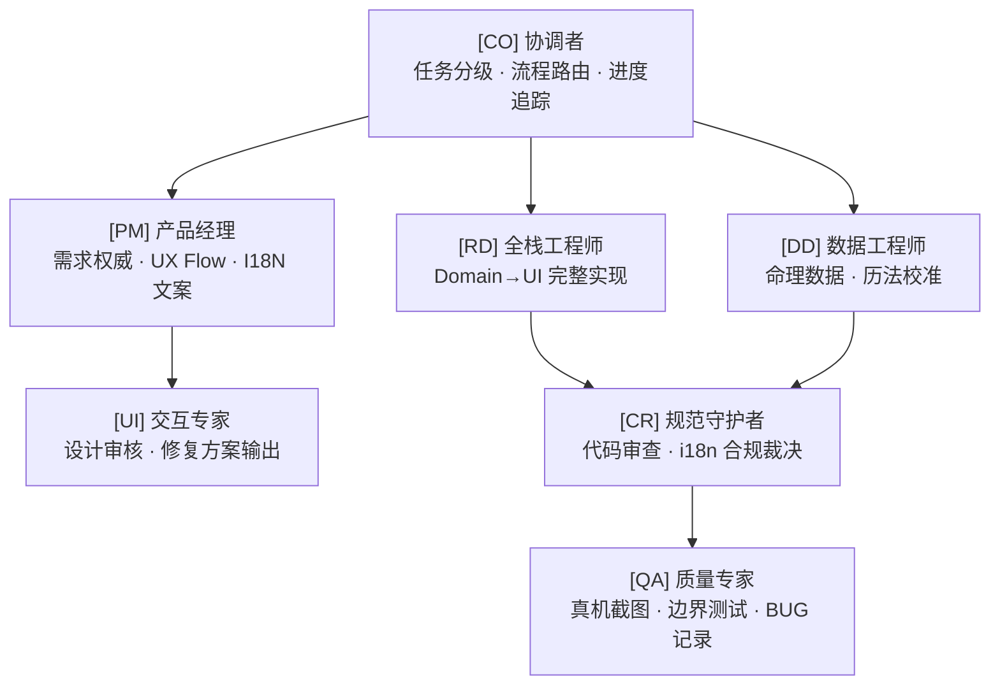

### [CO] 协调者 — 指挥官

```
职责：任务分级与分配、流程路由、进度追踪、统一交付汇总
输入：用户需求、各角色产出
输出：任务清单、状态板、history.md 归档
关键原则：Agent 空闲超 2 次提醒后直接接管执行；每阶段完成后执行 /compact
```

CO 是整个系统的调度器。它负责：
- 接收用户需求，分解为子任务
- 根据任务类型分配到对应 Agent
- 追踪各 Agent 进度，超时直接接管
- 汇总产出物，写入 `history.md`

### [PM] 产品经理 — 需求权威

```
职责：PRD.md 权威维护、业务价值定义、UX Flow 设计、I18N 文案审核、功能验收
输入：用户反馈、市场需求
输出：PRD.md 更新、文案规范、验收结论
关键原则：所有用户可见文案必须经 PM 确认后写入 strings.xml
```

PM 负责所有"用户看到什么"。它不写代码，但它是所有文案和功能需求的唯一权威来源。

### [RD] 全栈工程师 — 代码实现者

```
职责：Domain 层到 UI 层完整实现、构建调试、代码修复
输入：PRD.md、UI.md、CR 审查意见
输出：可运行代码、APK、BUG 修复记录
关键原则：所有字符串走 i18n 资源，禁止写死；修复前先 Read 文件再 Edit
```

RD 是真正的代码生产者。它遵循严格的 i18n 规范和不写死原则。

### [DD] 数据工程师 — 命理模型专家

```
职责：命理数据模型生成、历法数据采集与校准
输入：PRD 中的命理规则、外部历法数据源
输出：数据模型文件、校验报告
关键原则：黄道/八字规则须对照参考源校准（https://6tail.cn/calendar/api.html）
```

DD 负责最核心的数据准确性。所有八字规则、农历数据、五行映射必须经过校准才能入库。

### [CR] 规范守护者 — 质量门禁

```
职责：代码规范审查、i18n 合规裁决、架构一致性把关、技术文档审核
输入：RD/DD 提交的代码与文档
输出：审查意见、合规裁决
关键原则：发现违规（如写死文案、反射调用）须阻断并要求整改
```

CR 是最后一道防线。它不写代码，但它决定代码能否合入。

### [QA] 质量专家 — 真机测试者

```
职责：真机截图遍历、边界测试、性能基线、端到端验收、BUG 记录与回归
输入：可安装 APK、UI.md、测试用例
输出：截图记录、问题清单、BUG.md 条目、验收报告
关键原则：使用 phone-mcp 操作真机；发现问题写入 BUG.md 并标注严重等级
```

QA 是唯一与真机交互的 Agent。它通过 phone-mcp 自动化操作 Android 手机，逐页截图、逐功能验证。

### [UI] 交互专家 — 设计守护者

```
职责：UI 审核、交互规范制定、设计修复方案输出
输入：QA 截图与问题清单、Design Token 规范
输出：UI.md 修复方案、交互改造建议
关键原则：修复方案须符合 UI.md Design Token；不直接修改代码
```

UI 只输出方案，不写代码。它确保所有视觉产出符合设计规范。

## 1.3 工作流编排

### 五种标准工作流

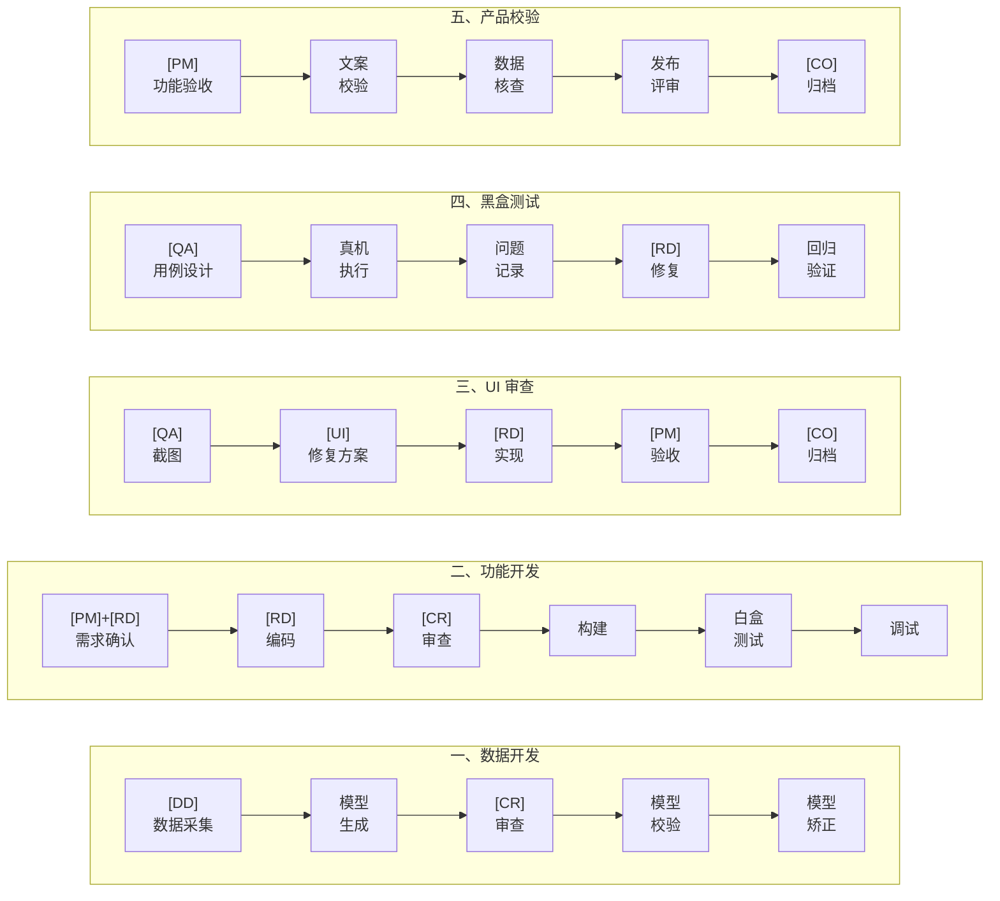

### 4 步 UI 审查循环（真机逐页审查）

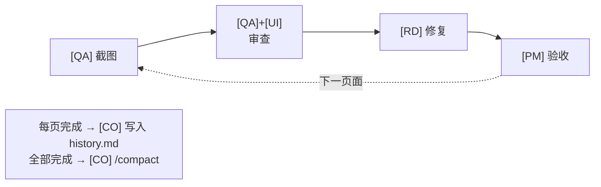

## 1.4 Agent 间通信协议

### 文档驱动通信

Agent 之间不直接对话。所有通信通过**共享文档**完成：

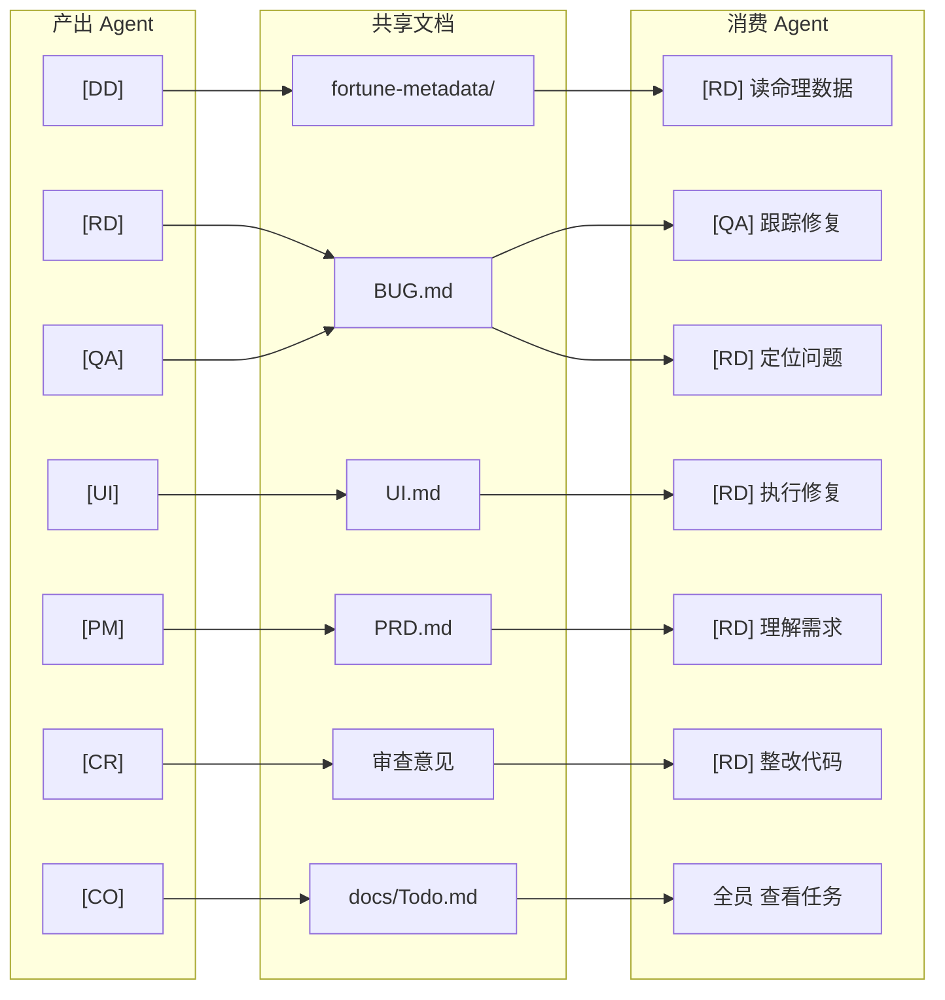

### 文档索引

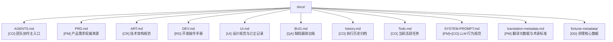

### 两条铁律

1. **Agent 空闲超 2 次提醒 → [CO] 直接接管执行**，不再等待。这防止了死锁 — 任何 Agent 卡住，CO 直接做。
2. **每阶段完成后 `/compact`**，压缩上下文。防止 context 膨胀导致的决策质量下降。

## 1.5 Agent 系统的工程意义

这套 Agent 系统的价值不仅仅是"自动化"：

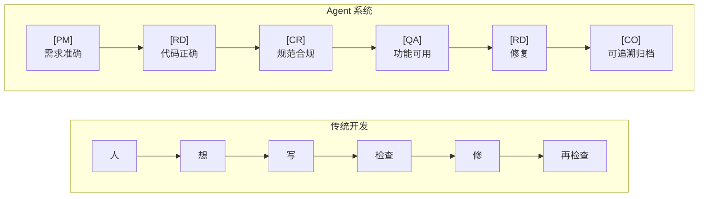

每个角色为最终交付物的一个维度负责。这不是让 AI 替人写代码，而是用 AI 构建开发组织的最小可行复制品 — 每个 Agent 专注一个视角，协作形成完整的质量闭环。

---

# 第二部分：产品侧 — 端侧 AI 推理引擎

## 2.1 整体架构

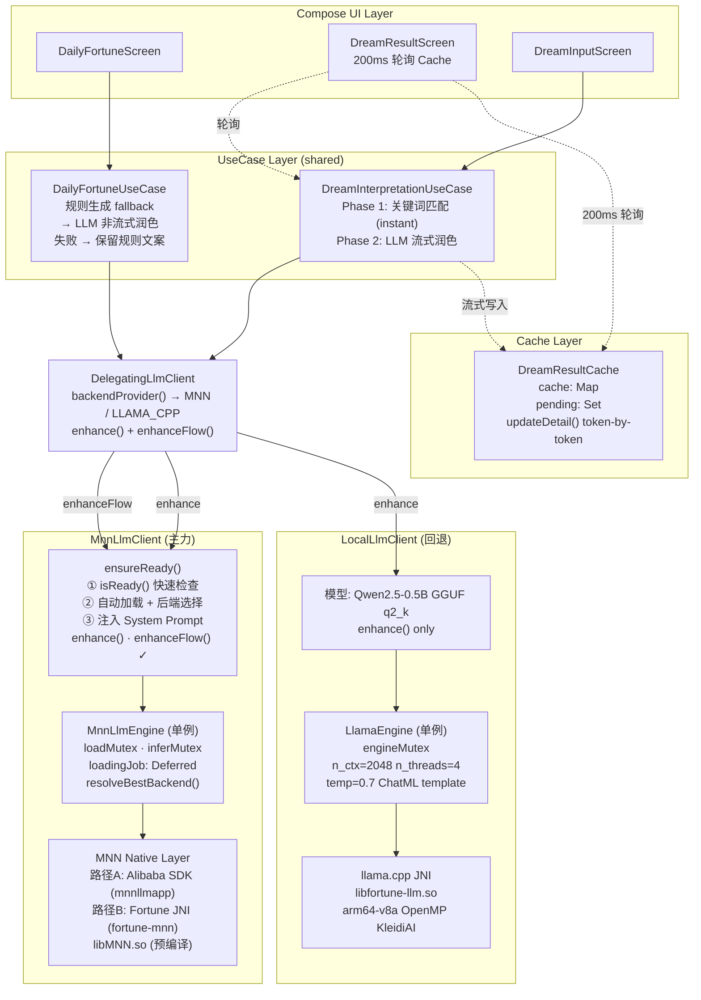

## 2.2 双引擎设计决策

| 维度 | MNN 引擎 | llama.cpp 引擎 |
|------|---------|---------------|
| **定位** | 生产主力 | 回退方案 |
| **模型** | Qwen3-0.6B (MNN INT4) | Qwen2.5-0.5B (GGUF q2_k) |
| **体积** | ~432MB (4 文件) | ~400MB (1 文件) |
| **推理后端** | CPU INT8 / GPU OpenCL | CPU only |
| **流式支持** | ✅ `enhanceFlow()` | ❌ 仅 `enhance()` |
| **速度** | 快（INT8 + 可选 GPU） | 较慢（纯 CPU） |
| **优势** | 移动端深度优化 | 成熟生态，格式通用 |
| **JNI** | `libmnnllmapp.so` / `libfortune-mnn.so` | `libfortune-llm.so` |

**为什么保留双引擎：**
- MNN 是主力但依赖特定模型格式（`.mnn`），模型转换有成本
- llama.cpp 支持通用 GGUF 格式，新模型接入快
- 如果 MNN 加载失败或模型不兼容，llama.cpp 作为安全网

## 2.3 MNN 引擎核心设计

### 2.3.1 并发加载保护 — 共享 Deferred 模式

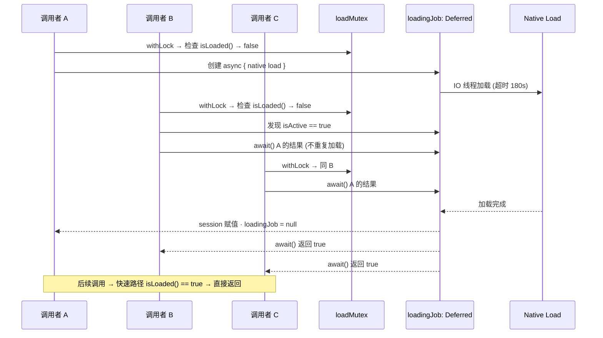

**为什么不用简单的 `synchronized`：** 简单的同步块会让 B、C 在 A 完成后各自再加载一遍。`Deferred` 共享让所有等待者复用同一个加载结果。

### 2.3.2 GPU 智能开关

```kotlin
fun resolveBestBackend(): String {
    // 步骤 1：检查 OpenCL 运行时是否可用
    if (!isOpenCLAvailable()) return "cpu"
    // System.loadLibrary("OpenCL") 可能因 Android 10+ linker namespace 限制失败

    // 步骤 2：评估设备性能
    if (!isHighEndDevice()) return "cpu"
    // cores >= 8 && maxCpuFreq >= 2.4GHz && RAM >= 16GB && API >= 31

    return "opencl"
}
```

**为什么中低端设备强制 CPU：** MNN 的 GPU (OpenCL) 推理有一个反直觉的事实 — 对小模型（0.6B），GPU kernel launch 开销 + CPU↔GPU 数据传输开销可能大于 GPU 并行计算节省的时间。只在高端设备（16GB+ RAM、旗舰 SoC）上 GPU 才有净收益。

设备检测不使用 `ActivityManager`（需要 Context），而是直接读取 `/proc/meminfo` 和 `/sys/devices/system/cpu/` — 零依赖，可在任何线程调用。

### 2.3.3 流式推理 — channelFlow 模式

```kotlin
// MnnLlmEngine.inferFlow()
fun inferFlow(system: String, userPrompt: String, maxTokens: Int): Flow<String> = channelFlow {
    val accumulated = StringBuilder()
    inferMutex.withLock {
        val onToken: (String) -> Unit = { chunk ->
            accumulated.append(chunk)
            // JNI onProgress 在 native/IO 线程触发
            // launch 确保 send 在正确的协程上下文
            launch { send(accumulated.toString()) }
        }
        session.infer(userPrompt, maxTokens, onToken)  // JNI 回调模式
    }
}
```

**关键设计：**
- 发射的是**累积文本**（不是增量 chunk）— UI 层无需拼接，直接覆盖渲染
- `launch { send() }` 处理跨线程问题 — JNI 回调线程可能不是协程线程
- `inferMutex.withLock` 保证同一时间只有一个流式推理在执行
- 自然形成 200ms 批处理（见 2.4.2）— 减少 UI 重组频率

### 2.3.4 Native 构建配置

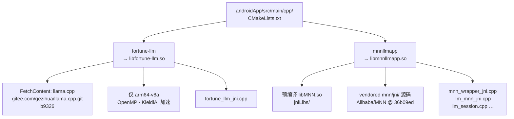

## 2.4 业务集成模式

### 2.4.1 非流式 — 每日运势 AI 润色

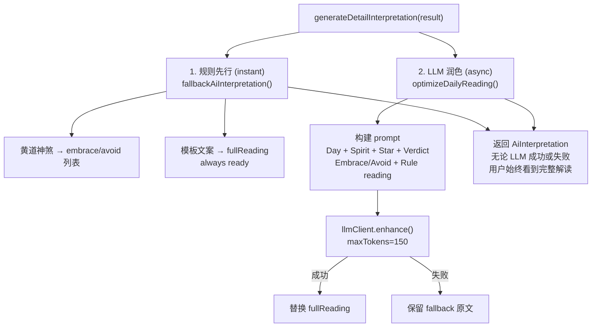

### 2.4.2 流式 — 梦境解析"书写"体验

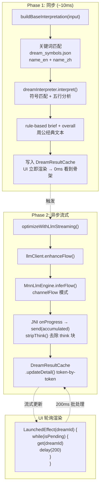

**两阶段的设计价值：**
1. 规则匹配极快（~10ms），用户无需等待白屏
2. LLM 逐字写入，用户看到"AI 正在书写"，体验像人类打字
3. 200ms 轮询自然批处理多个 token，减少 Compose 重组
4. LLM 失败 → detailed 保持空 → UI 用 `fallbackDetailedFor()` 填充 → 完整

### 2.4.3 容错层级

| 优先级 | 文案来源 | 触发条件 |
|--------|---------|---------|
| L1 | LLM 流式润色（逐字） | MNN 模型就绪 |
| L2 | LLM 非流式润色 | llama.cpp 引擎 |
| L3 | 规则模板文本 | LLM 异常 / 输出 < 20 字符 |
| L4 | 硬编码英文回退 | 规则模板故障 |

**每一层失败自动降级到下一层，用户始终能看到结果。**

### 2.4.4 DreamResultCache — 流式生命周期

```kotlin
object DreamResultCache {
    private val cache = mutableMapOf<String, DreamInterpretation>()
    private val pending = mutableSetOf<String>()  // 正在流式写入

    fun put(id: String, result: DreamInterpretation)
    fun get(id: String): DreamInterpretation?
    fun updateDetail(id: String, text: String)    // token-by-token 更新
    fun markPending(id: String)                   // Phase 2 开始
    fun markComplete(id: String)                  // Phase 2 结束或失败
    fun isPending(id: String): Boolean            // UI 轮询条件
}
```

## 2.5 模型下载管线

### 2.5.1 三层架构

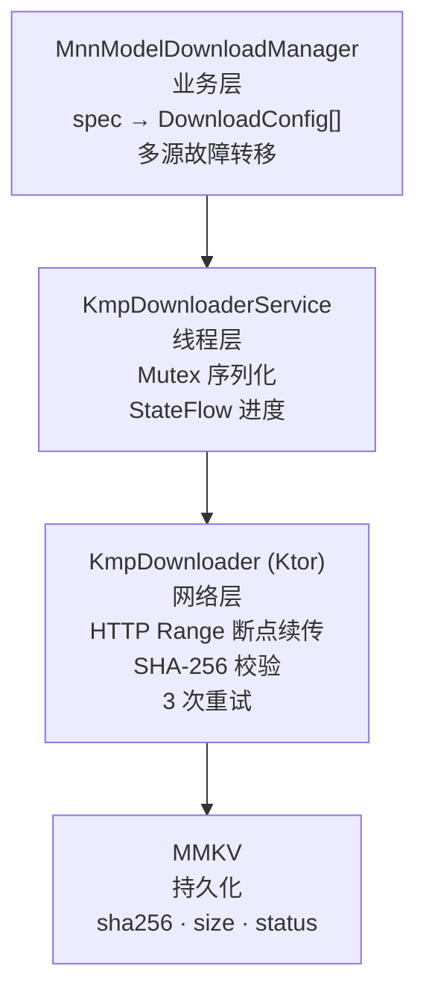

### 2.5.2 多源故障转移 + 加权进度

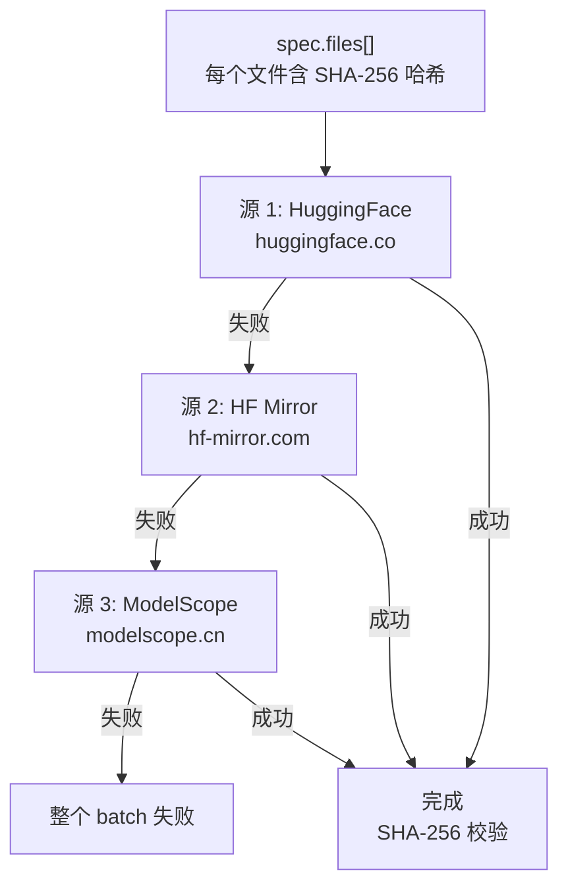

**进度计算：** `Σ(已完成文件 minBytes) / Σ(所有文件 minBytes)` — 按文件大小加权，非按文件数量平分。

**断点续传：** `Range: bytes={existing}-`。服务器忽略 Range（某些 CDN）→ 检测 `200` 非 `206` → 丢弃 `.tmp` 重头下载。

### 2.5.3 就绪检查的两级策略

```kotlin
// 每次推理前 — 快速 (不扫描 430MB 文件)
fun isReady(): Boolean = spec.files.all { 
    file.exists() && file.length() >= minBytes 
}

// 下载完成/用户主动 — 完整 (SHA-256 扫描)
fun verifyIntegrity(): Boolean = spec.files.all { 
    sha256(file) == expectedSha 
}
```

---

# 第三部分：命理计算引擎

## 3.1 FortuneEngine — 统一命理入口

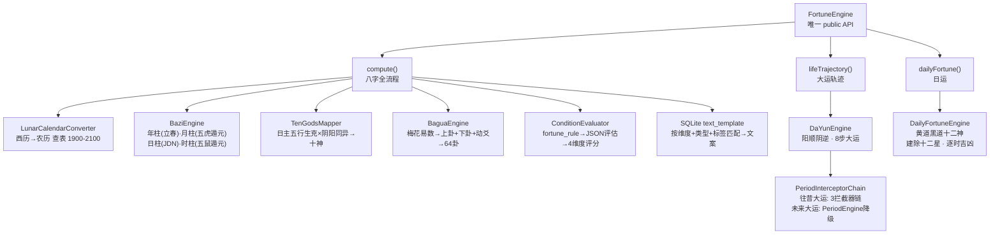

**架构要点：**
- `FortuneEngine` 是唯一 public 类，所有 internal engine 通过它暴露
- 旧 `FortuneInterpreter` + `TextGenerator` 已移除，解读逻辑内联到 `FortuneEngine`
- 文案模板走 SQLite `text_template` 表，按 dimension + type + tags 三级匹配
- `JsonAssetLoader` 统一所有资产加载入口，禁止直接 `openAsset()`

## 3.2 大运拦截链 — Chain of Responsibility

```kotlin
// DaYunEngine 内部，仅对"往昔大运"生效
class PeriodInterceptorChain(
    private val interceptors: List<PeriodInterceptor>
) : PeriodInterceptor {
    
    override fun intercept(context: PeriodContext): PeriodContext =
        interceptors.fold(context) { ctx, interceptor ->
            interceptor.intercept(ctx)
        }
    
    companion object {
        fun default(...) = PeriodInterceptorChain(listOf(
            DataFetchInterceptor(),    // ① 获取十年基础解读
            YearEventInterceptor(),    // ② 逐年扫描地支六冲/六合/伏吟
            TextBuildInterceptor()     // ③ 编织自然语言叙述
        ))
    }
}
```

**设计要点：**
- 仅对**往昔大运**（已过去的运程）生效 — 未来运程走 `PeriodEngine` 降级链
- 使用 `fold` 而非传统 `next()` 指针 — 每个拦截器输出是下一个的输入，纯函数风格
- `YearEventInterceptor` 逐日柱年份扫描：地支六冲(⚡)、六合(🤝)、伏吟(🔄)，生成真实事件而非通用模板

## 3.3 大运文本生成 — 个性化降级链

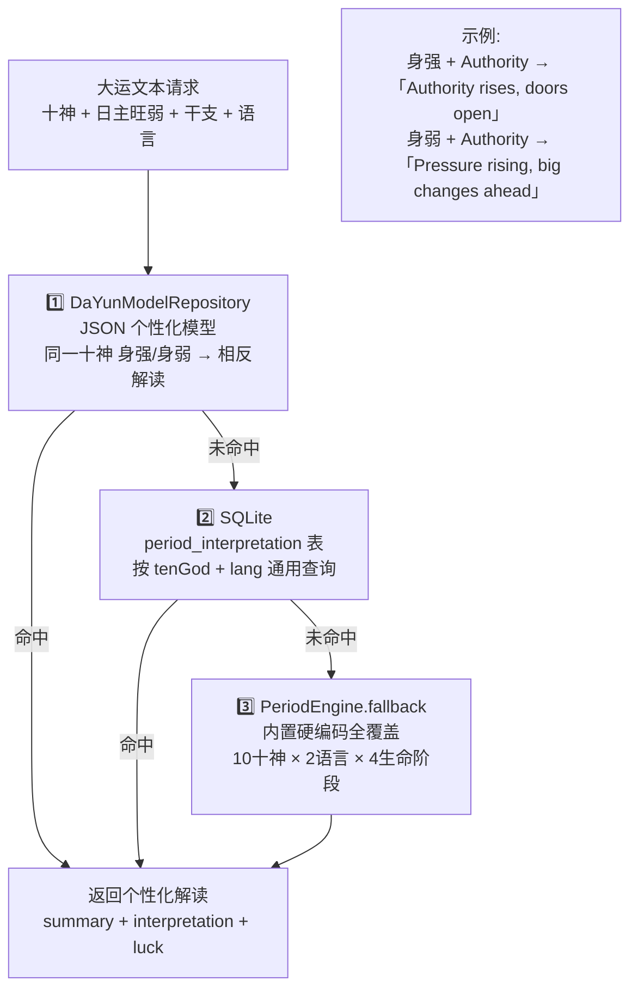

**为什么不用旧 DYFM 二进制模型：** 旧 `fortune_text.tflite` (DYFM magic bytes) 是专有二进制格式，维护成本高。v1.10 重构后用 JSON 文件 (`rules_data.json`) + SQLite 表替代，体积更小（KB 级），可读可改，且不需要 TFLite 运行时依赖。

## 3.4 日运引擎 — 双重神煞体系

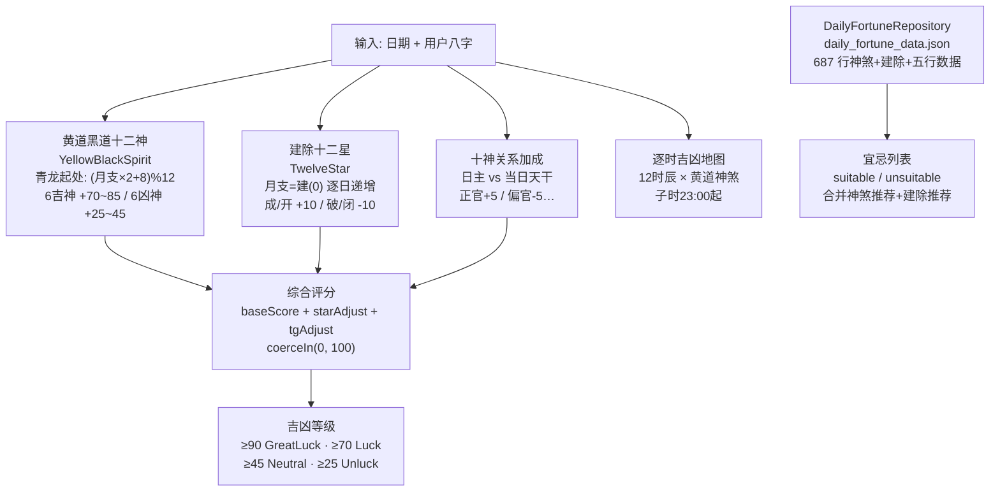

**数据源：** `daily_fortune_data.json` (687 行) — 神煞宜忌 + 建除宜忌 + 五行个性笔记
**参考标准：** 协纪辨方书卷六，对照 6tail.cn 校准

---

# 第四部分：技术栈全览

## 4.1 层次总览

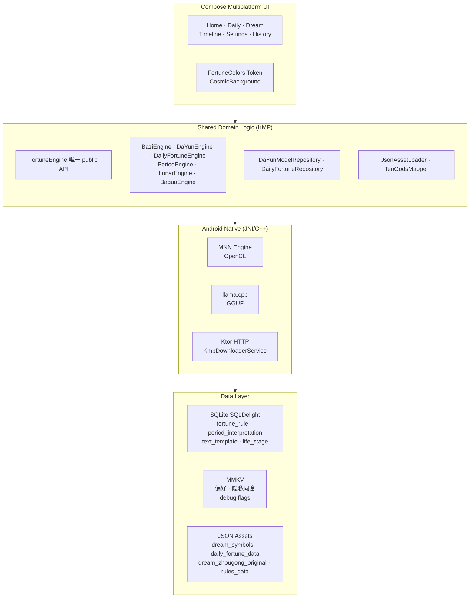

## 4.2 关键技术选型

| 层级 | 技术 | 理由 |
|------|------|------|
| UI | Compose Multiplatform | Android + iOS 共享 UI 代码 |
| 共享逻辑 | Kotlin Multiplatform | Domain 层一次编写双端复用 |
| 端侧推理 | MNN + llama.cpp | 隐私优先，离线可用 |
| 本地存储 | MMKV + SQLDelight | 高频读写(MMKV) + 结构化查询(SQL) |
| 资产加载 | JsonAssetLoader | 统一入口，禁止直接 openAsset() |
| 下载引擎 | Ktor HttpClient | KMP 原生，支持 Range / 流式 |
| DI | Koin | KMP 兼容，轻量 |
| 支付 | Google Play Billing 7.0 | 一次性购买模式 |
| 部署 | fastlane | Google Play 自动上传 AAB |
| 真机测试 | phone-mcp | MCP 协议操作 Android 真机 |

## 4.3 安全与性能

| 方面 | 措施 |
|------|------|
| 隐私 | 无账号体系，数据仅存设备 |
| AI 隐私 | 端侧推理，prompt 不上传 |
| 代码保护 | ProGuard/R8 混淆 + native 方法保护 |
| 模型完整性 | SHA-256 校验（嵌入式 hash + x-linked-etag） |
| 崩溃防护 | Mutex 保护 native session，180s 超时 |
| 内存控制 | 4-bit 量化模型 ~456MB，低端设备强制 CPU 推理 |
